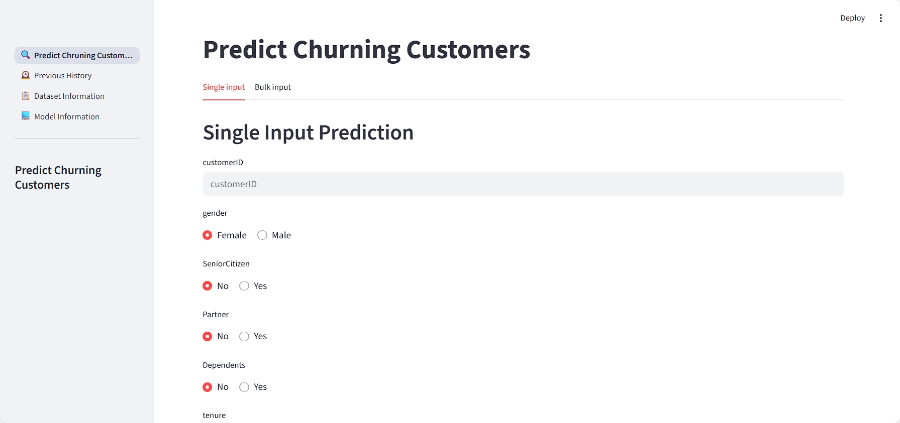
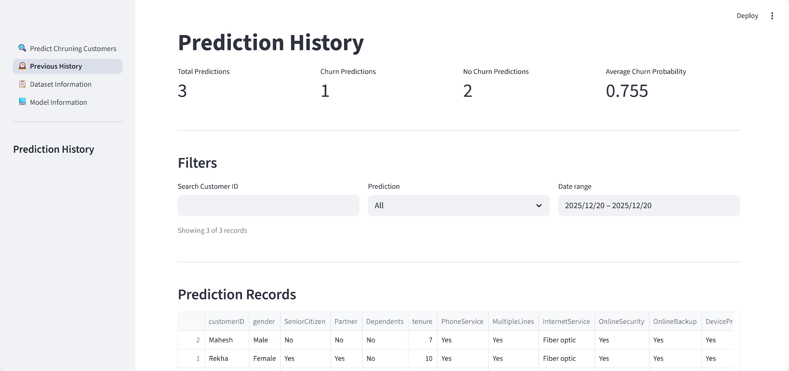
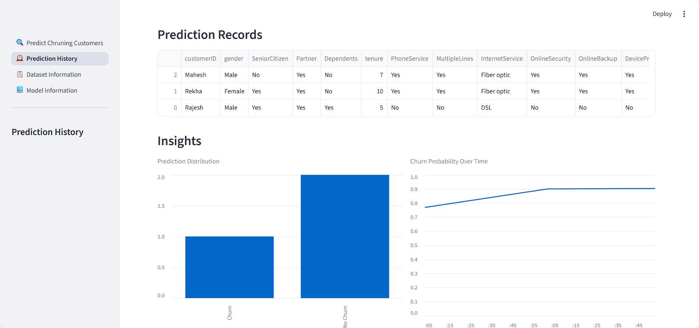
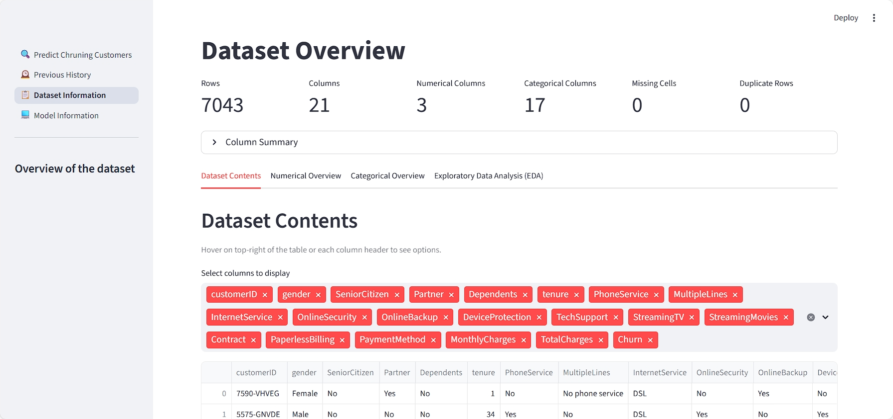
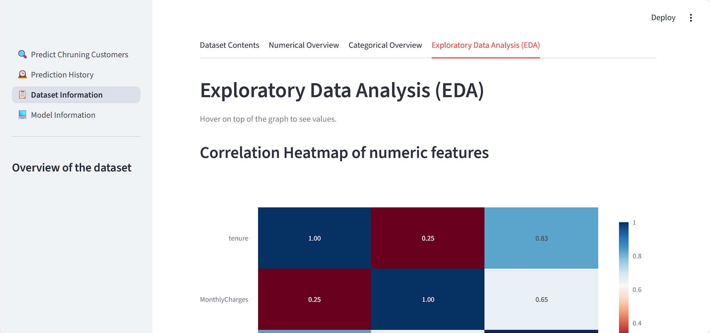
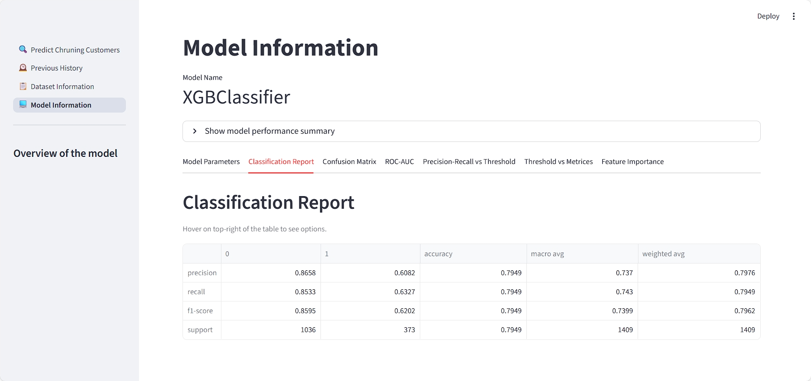
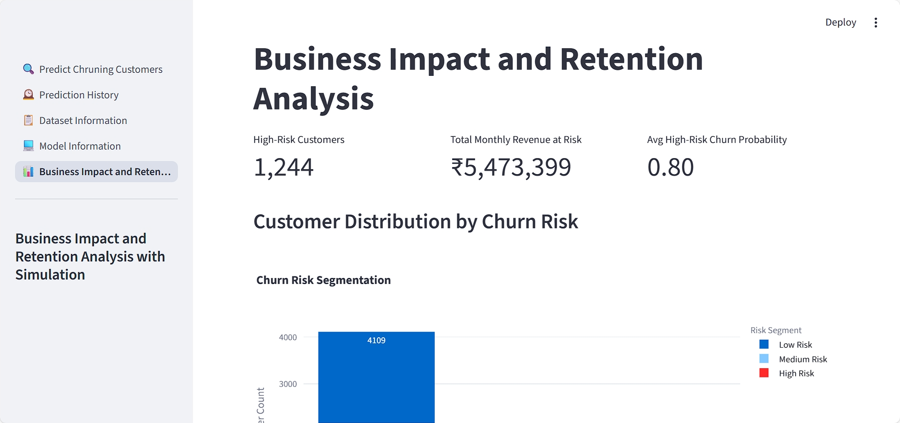
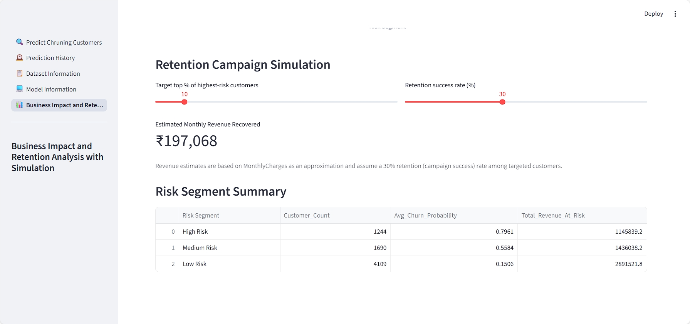

## Churn Prediction System:
**A machine learning application for predicting customer churn using historical behavioral and transactional data.**

The system provides churn probability scores at the customer level, supports both single and bulk predictions, and includes interactive dashboards for data exploration, model evaluation, and business decision support. It is designed to help organizations identify at-risk customers and optimize retention strategies.

**The models are trained using the <a href="https://www.kaggle.com/datasets/blastchar/telco-customer-churn">Telecom Customer Churn</a> dataset.**

## Problem Statement
Customer churn leads to significant revenue loss and increased customer acquisition costs.

The objective of this project is to:
1. Predict which customers are likely to churn
2. Quantify churn risk using probability scores
3. Enable data-driven retention decisions

## System Requirements:
1. Operating System: Windows / Linux / macOS
2. Python version: 3.9+

## Dependencies:

# Standard Python Libraries
1. <code>logging</code>:- For logging processes.
2. <code>pathlib</code>:- For holding paths.
3. <code>pickle</code>:- For storing Python objects.

# Third-Party Libraries
1. <code>imblearn</code>:- For <code>SMOTE</code> oversampling and pipeline.
2. <code>joblib</code>:- For storing trained models.
3. <code>pandas</code> and <code>numpy</code>:- For working with datasets and csv files.
4. <code>matplotlib</code> and <code>plotly</code>:- For dataset visualization and graphs.
5. <code>scikit-learn</code>:- For data preprocessing, classification model and benchmarking.
6. <code>xgboost</code>:- For <code>XGBClassifier</code> classification model.
7. <code>streamlit</code>:- For accessing the application frontend.

## Features
1. Supports configurable decision thresholds for churn prediction to balance precision and recall.
2. Enables experimentation with multiple classification models, including <code>XGBClassifier</code>, <code>Logistic Regression</code>, <code>SVC</code>, <code>DecisionTreeClassifier</code>,and <code>RandomForestClassifier</code>.
3. Utilizes <code>RandomizedSearchCV</code> for hyperparameter optimization.
4. Provides interactive dashboards and in-depth exploratory analysis for model performance evaluation.
5. Maintains prediction and model evaluation history for analysis and comparison.

## Model Retraining
To retrain the model using a different classification algorithm, modify the training notebook to select the desired model and re-execute the notebook. The updated model and related artifacts will be generated and can be used by the application without further code changes.

**If multiple classification models are evaluated during retraining, the system automatically selects and persists the model with the best cross-validation ROC-AUC score as the final model.**

## Installation
**Follow the steps below to set up the project locally.**
### 1. Clone the repository
```bash
git clone https://github.com/Kaush1590/FUTURE_ML_02.git
cd FUTURE_ML_02
```
### 2. Create and activate a virtual environment
## Linux / macOS
```bash
python -m venv <environment_name>
source venv/bin/activate
```
## Windows
```bash
python -m venv <environment_name>
venv\Scripts\activate
```
## Anaconda
```bash
conda create -n <environment_name> python=3.9 -y
conda activate <environment_name>
```
### 3. Install required dependencies
```bash
pip install -r requirements.txt
```
### 4. Run the application
```bash
cd app
streamlit run app.py
```
Once started, open the URL displayed in the terminal to access the application.

## Application Modules
1. **Dataset Overview:** Data summary, missing values, outliers, distributions
2. **EDA Dashboard:** Correlation heatmap, box plots, histograms
3. **Model Information:** Metrics, ROC-AUC, PR-AUC, confusion matrix
4. **Prediction Module:** Single input and bulk input CSV predictions

## Business Value
1. Early identification of churn-prone customers.
2. Optimized retention spending.
3. Actionable insights into churn drivers.
4. Support for strategic pricing and contract decisions.

## Acknowledgment
1. Kaggle for providing dataset
2. Open-source Python community

## Application Screenshots

### Churn Prediction Dashboard


### History Dashboard



### Dataset Overview Dashboard



### Model Performance Dashboard



### Business Impact and Retention Analysis


